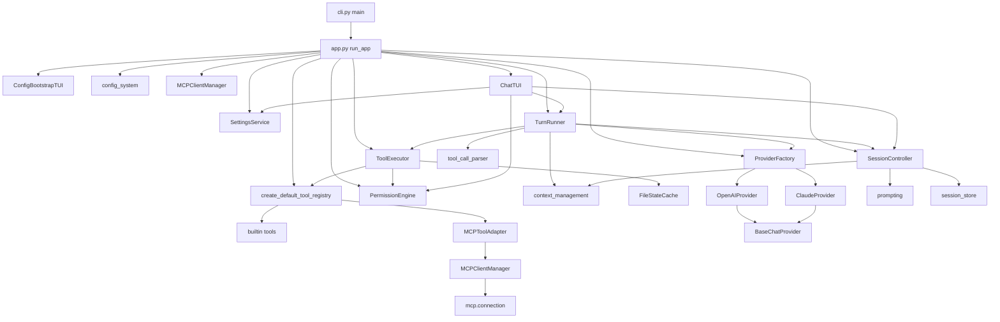

# 架构

## 整体架构

LanCher Code 是一个**单进程、异步（asyncio）**的终端应用，采用分层结构：

```text
用户
 ↓ 键盘输入
┌─────────────────────────────┐
│ Textual TUI（tui_views/）    │  界面层：渲染、键盘、弹窗
└─────────────────────────────┘
 ↓ ComposerSubmitted / 事件流
┌─────────────────────────────┐
│ TurnRunner（turn_runner.py） │  流程层：ReAct 工具循环
└─────────────────────────────┘
     ↓             ↓              ↓
┌──────────┐ ┌───────────┐ ┌──────────────────┐
│ Session  │ │ Provider  │ │ ToolExecutor     │
│Controller│ │ (openai/  │ │  + ToolRegistry  │
│ (会话层) │ │  claude)  │ │  + Permission    │
└──────────┘ └───────────┘ └──────────────────┘
     ↓             ↓              ↓
 提示词构建     模型 API      文件系统 / shell / MCP Server
```

关键设计决策：

- **协议无关的 transcript**：会话层保存的是 `ConversationMessage` 抽象消息，由 Provider 在发送前各自序列化为 OpenAI / Claude 协议格式（见 `providers/*` 的 `_serialize_message`）。
- **事件流解耦**：`TurnRunner.run_user_turn()` 是一个异步生成器，产出 `TurnEvent`；TUI 只消费事件更新界面，不直接调用 Provider。
- **权限判定在工具执行前**：`ToolExecutor` 对每个工具调用先过 `PermissionEngine`，只有 `allow` 才真正执行。
- **全程异步**：`app.py` 在 `asyncio.run()` 中运行；网络请求（httpx）、子进程（bash 工具）、文件卸载（`asyncio.to_thread`）都是异步的。

## 核心组件

| 组件 | 类 / 入口 | 职责边界 |
|---|---|---|
| 应用装配 | `app.run_app()` | 只做组装，不做业务逻辑 |
| 会话控制器 | `SessionController`（`session.py`） | 会话状态、transcript、模式、持久化 |
| 工具循环 | `TurnRunner`（`turn_runner.py`） | 一次对话回合的循环调度、取消、压缩触发 |
| 上下文治理 | `context_management.py` | Token 估算、结果卸载、摘要压缩（纯函数 + 少量 IO） |
| 权限引擎 | `PermissionEngine` / `PermissionStorage`（`permission_engine.py`） | 权限判定与规则存储，不执行工具 |
| 工具系统 | `ToolRegistry` / `ToolExecutor` / `Tool`（`tools/`） | 工具注册、调度、执行 |
| 模型供应商 | `ChatProvider` 协议 + `BaseChatProvider`（`providers/`） | 统一流式事件输出 |
| MCP 客户端 | `MCPClientManager`（`mcp/`） | MCP Server 生命周期与工具注册 |
| 设置服务 | `SettingsService`（`settings_service.py`） | 设置页三类配置的读写与校验 |
| TUI | `LanCherTextualApp` / `ChatTUI`（`tui_views/chat.py`） | 界面渲染与交互 |

## 模块依赖关系



## 核心数据流：一轮对话

以下为一次用户输入从进入到结束的完整路径（详细流程见 [workflows/user-turn.md](workflows/user-turn.md)）：

```text
用户输入
→ ComposerTextArea 提交（tui_views/composer.py 发出 ComposerSubmitted）
→ ChatTUI.handle_input_submitted
   ├─ 解析斜杠命令（slash_commands.py），命中则先执行命令
   └─ TurnRunner.run_user_turn(text)
       ├─ SessionController.create_user_message()  创建用户消息 + 动态提醒
       ├─ SessionController.create_assistant_message()
       └─ 工具循环（最多 tool_loop_limit 次）：
           ├─ 估算 Token，必要时自动压缩上下文
           ├─ SessionController.build_request() → 组装 ChatRequest
           ├─ Provider.stream_chat(request) → StreamEvent 流
           │    ├─ text_delta → 追加到消息内容
           │    ├─ thinking_delta → 写入思考轨迹
           │    └─ tool_call_delta → ToolCallAssembler 拼接
           ├─ ToolCallAssembler.finalize() → ToolCall 列表
           ├─ ToolExecutor.execute_calls()：
           │    ├─ PermissionEngine.evaluate()（五层判定）
           │    ├─ 需要确认 → PermissionRequest → TUI InlinePermissionPanel → 用户选择
           │    └─ 执行工具（并发安全分组 + 超时）
           ├─ 工具结果写回 transcript，事件回传 TUI
           └─ 循环直到模型不再调用工具
→ SessionController.complete_message()  标记完成 + 累计用量
→ 事件流结束，TUI 恢复输入，自动保存会话
```

## 权限系统（五层）

工具调用在真正执行前，会依次经过 `PermissionEngine.evaluate()` 的五层检查：

```text
① 危险命令黑名单（bash 工具）—— 命中即 deny，不可绕过
② 路径沙箱 —— 文件类工具路径必须落在项目根目录内（解析符号链接后判断）
③ 规则引擎 —— session > project > user 三层规则，格式 ToolLabel(value)
④ 权限模式 —— default / plan / acceptEdits / bypass
⑤ 人在回路 —— 仍未放行时生成 PermissionRequest，TUI 弹窗由用户决定
```

优先级：**黑名单 > 规则 > 模式 > 弹窗确认**。`bypass` 模式下规则与黑名单依然生效。详见 [modules/permission-engine.md](modules/permission-engine.md)。

## 关键对象生命周期

### `SessionController`（`session.py`）

```text
app.run_app() 创建
→ 绑定 provider_config / cwd / plan 文件路径 / 初始模式
→ 每轮对话：create_user_message → create_assistant_message → 流式追加 → complete_message
→ 会话命名后（/session save）：每次状态变更 auto_save 写 JSONL
→ 进程退出：内存状态自然销毁（未保存的会话可通过 /session save 留存）
```

### `TurnRunner`（`turn_runner.py`）

```text
构造时注入 provider / session / registry / executor
→ run_user_turn()：创建后台任务 _run_turn + 事件队列
→ 消费者（TUI）逐个 await 事件
→ 事件流结束（_QUEUE_END）后任务回收
→ cancel_active_turn()：取消令牌 + 取消任务 + 取消挂起的权限请求
```

### MCP 连接（`mcp/connection.py`）

```text
MCPClientManager.initialize() → 每个 Server 并行 connect_and_list_tools()
→ MCPServerConnection 后台任务运行（stdio / streamable_http）
→ 初始化 + 列出工具 → 注册为延迟工具
→ app 退出时 mcp_manager.close() 统一关闭
```

## 并发与异步模型

- 单 asyncio 事件循环，无多线程业务逻辑；文件 IO 通过 `asyncio.to_thread` 卸载（如大工具结果落盘）。
- `ToolExecutor` 对 `is_concurrency_safe=True` 的工具（读类工具）做**批量并发执行**；写类工具串行执行。
- MCP Server 初始化并发进行，单个失败不影响其他 Server。
- 权限弹窗期间，`TurnRunner` 通过 `asyncio.Future` 挂起等待用户决议，不阻塞事件循环。
