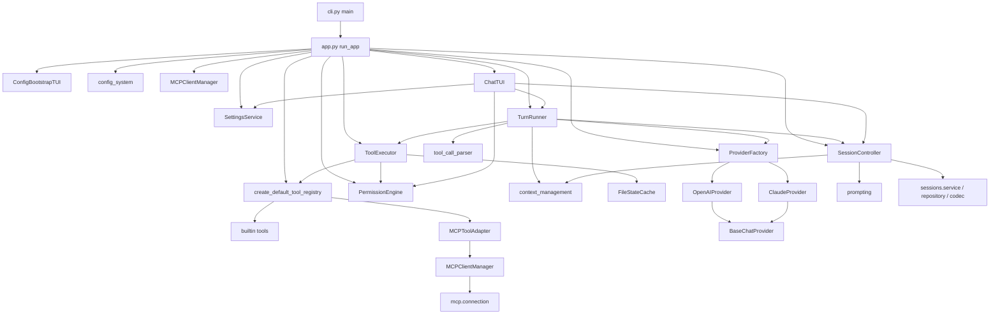
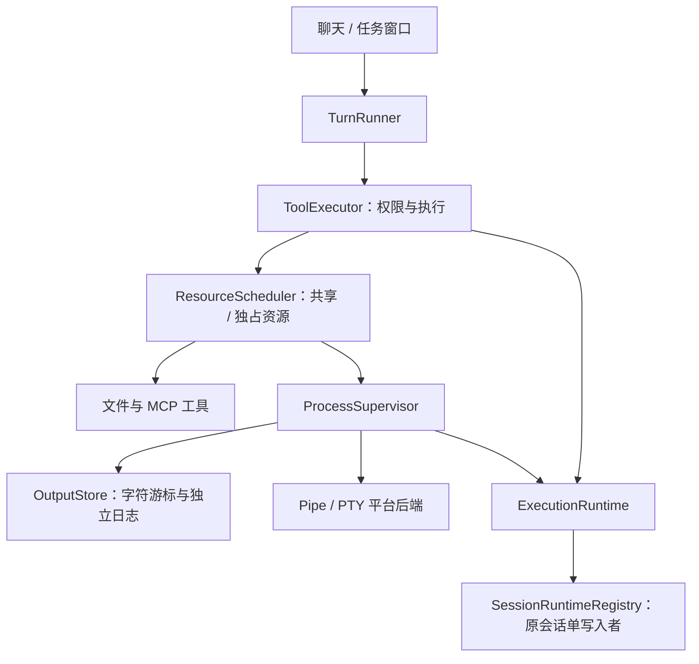

# 架构

## 整体架构

LanCher Code 是一个**单进程、异步（asyncio）**的终端应用，采用分层结构：

```text
用户
 ↓ 键盘输入
┌─────────────────────────────┐
│ Textual TUI（tui_views/）    │  界面层：渲染、键盘、弹窗
└─────────────────────────────┘
 ↓ ComposerSubmitted / 事件流
┌─────────────────────────────┐
│ TurnRunner（turn_runner.py） │  流程层：ReAct 工具循环
└─────────────────────────────┘
     ↓             ↓              ↓
┌──────────┐ ┌───────────┐ ┌──────────────────┐
│ Session  │ │ Provider  │ │ ToolExecutor     │
│Controller│ │ (openai/  │ │  + ToolRegistry  │
│ (会话层) │ │  claude)  │ │  + Permission    │
└──────────┘ └───────────┘ └──────────────────┘
     ↓             ↓              ↓
 提示词构建     模型 API      文件系统 / shell / MCP Server
```

关键设计决策：

- **协议无关的 transcript**：会话层保存的是 `ConversationMessage` 抽象消息，由 Provider 在发送前各自序列化为 OpenAI / Claude 协议格式（见 `providers/*` 的 `_serialize_message`）。
- **事件流解耦**：`TurnRunner.run_user_turn()` 是一个异步生成器，产出 `TurnEvent`；TUI 只消费事件更新界面，不直接调用 Provider。
- **阶段与权限独立**：讨论、计划、执行决定可用工具范围，逐次确认、自动编辑、跳过询问决定范围内工具的审批方式。阶段边界同时应用于工具发现和实际执行。
- **权限判定在工具执行前**：`ToolExecutor` 对每个工具调用先过 `PermissionEngine`，只有 `allow` 才真正执行。
- **全程异步**：`app.py` 在 `asyncio.run()` 中运行；网络请求（httpx）、子进程（run_command 工具）、文件卸载（`asyncio.to_thread`）都是异步的。

## 核心组件

| 组件 | 类 / 入口 | 职责边界 |
|---|---|---|
| 应用装配 | `app.run_app()` | 只做组装，不做业务逻辑 |
| 会话控制器 | `SessionController`（`session.py`）与 `sessions/` | 会话状态、transcript、阶段、权限、计划与队列；独立 UUID 和事件日志持久化 |
| 工具循环 | `TurnRunner`（`turn_runner.py`） | 回合调度、忙时输入投递、取消、压缩与计划确认 |
| 上下文治理 | `context_management.py` | Token 估算、结果卸载、摘要压缩（纯函数 + 少量 IO） |
| 权限引擎 | `PermissionEngine` / `PermissionStorage`（`permission_engine.py`） | 权限判定与规则存储，不执行工具 |
| 工具系统 | `ToolRegistry` / `ToolExecutor` / `Tool`（`tools/`） | 工具注册、调度、执行 |
| 模型供应商 | `ChatProvider` 协议 + `BaseChatProvider`（`providers/`） | 统一流式事件输出 |
| MCP 客户端 | `MCPClientManager`（`mcp/`） | MCP Server 生命周期与工具注册 |
| 设置服务 | `SettingsService`（`settings_service.py`） | 模型、界面偏好、MCP、权限规则的隔离保存与校验 |
| TUI | `LanCherTextualApp` / `ChatTUI`（`tui_views/chat.py`） | 界面渲染与交互 |

## 模块依赖关系



## 核心数据流：一轮对话

以下为一次用户输入从进入到结束的完整路径（详细流程见 [workflows/user-turn.md](workflows/user-turn.md)）：

```text
用户输入
→ ComposerTextArea 提交（tui_views/composer.py 发出 ComposerSubmitted）
→ ChatTUI.handle_input_submitted
   ├─ 工作中：按用户选择保留草稿、补充当前任务或排到下一轮
   ├─ 解析斜杠命令（slash_commands.py），命中则先执行命令
   └─ TurnRunner.run_user_turn(text)
       ├─ SessionController.create_user_message()  创建用户消息 + 动态提醒
       ├─ SessionController.create_assistant_message()
       └─ 工具循环（最多 tool_loop_limit 次）：
           ├─ 估算 Token，必要时自动压缩上下文
           ├─ SessionController.build_request() → 组装 ChatRequest
           ├─ Provider.stream_chat(request) → StreamEvent 流
           │    ├─ text_delta → 追加到消息内容
           │    ├─ thinking_delta → 写入思考轨迹
           │    └─ tool_call_delta → ToolCallAssembler 拼接
           ├─ ToolCallAssembler.finalize() → ToolCall 列表
           ├─ ToolExecutor.execute_calls()：
           │    ├─ 冻结参数 + 标准 JSON Schema 校验（离线引用解析）
           │    ├─ 阶段工具边界 + PermissionEngine.evaluate()（五层判定）
           │    ├─ 需要确认 → PermissionRequest → TUI InlinePermissionPanel → 用户选择
           │    └─ 执行工具（权限复核 + 资源调度 + 托管执行）
           ├─ 工具结果写回 transcript，事件回传 TUI
           └─ 循环直到模型不再调用工具
→ SessionController.complete_message()  标记完成 + 累计用量
→ 事件流结束，TUI 更新状态、自动保存会话；成功后可投递下一条排队输入，取消/失败则暂停队列
```

## 阶段边界与权限系统

`tool_available_in_phase()` 先限定阶段工具范围：讨论与计划的源码只读，但当前 Session workspace 允许内置文件读写；计划另可保存计划正文；执行允许常规工具。讨论/计划阶段不开放 run_command；MCP 仅在服务端明确标记只读时进入只读范围。随后 `PermissionEngine.evaluate()` 处理以下检查：

```text
① 文件路径边界 —— 项目根、当前 Session workspace 和内部控制文件边界
② 危险命令黑名单（run_command 工具）—— 命中即 deny，不可绕过
③ 规则引擎 —— session > project > user 三层规则，格式 ToolLabel(value)
④ 权限策略 —— default / acceptEdits / bypass
⑤ 人在回路 —— 仍未放行时生成 PermissionRequest，TUI 弹窗由用户决定
```

阶段边界、文件路径边界与黑名单均不可被允许规则或 `bypass` 覆盖。当前 Session workspace 的文件工具写入已批准，但显式拒绝仍生效；普通路径按 **规则 > 权限策略 > 用户确认** 判定，同层规则最后匹配者生效。新权限授权使用 `exact` 精确匹配，设置中可显式维护 `glob` 通配或保留 `legacy` 旧规则。文件工具边界不构成操作系统沙箱。详见 [modules/permission-engine.md](modules/permission-engine.md)。

## 关键对象生命周期

### `SessionController`（`session.py`）

```text
app.run_app() 创建
→ 绑定 provider_config / cwd / 初始阶段与权限，尚无 Session ID
→ 每轮对话：create_user_message → create_assistant_message → 流式追加 → complete_message
→ 首条用户消息：先创建 UUID Session 和 workspace，再调用模型
→ 状态变更：增量追加事件，流式短间隔刷新、关键边界同步刷新
→ /session new 或 resume：刷新旧会话并切换写入者
→ 有后台或控制操作的原会话保留写入者；闲置后保存快照并释放
→ 应用退出：先收尾托管进程，再 close 刷新、写快照、释放文件锁
```

### `TurnRunner`（`turn_runner.py`）

```text
构造时注入 provider / session / registry / executor
→ run_user_turn()：创建后台任务 _run_turn + 事件队列
→ 消费者（TUI）逐个 await 事件
→ 事件流结束（_QUEUE_END）后任务回收
→ 工作中输入：steer 在安全边界投递；follow_up 等当前任务成功结束后排到下一轮
→ cancel_active_turn()：取消令牌 + 取消任务 + 取消挂起的权限请求 + 暂停待处理输入
```

### MCP 连接（`mcp/connection.py`）

```text
MCPClientManager.initialize() → 每个 Server 并行 connect_and_list_tools()
→ MCPServerConnection 后台任务运行（stdio / streamable_http）
→ 初始化 + 列出工具 → 注册为延迟工具
→ app 退出时 mcp_manager.close() 统一关闭
```

## 设置与首次配置

首次配置按“连接供应商 → 添加第一个模型 → 确认并开始”进行，仅最终确认写入配置。供应商保存连接地址、密钥、协议与超时，模型保存 API 名称、显示名称和可选覆盖；模型通过稳定引用 `provider_id/model_id` 标识。

设置默认打开供应商与模型目录，分别显示“本次对话使用”和“新对话默认”。切换本次模型只更新运行时；更改默认只影响新对话。每个表单独立保存，成功后返回目录，返回时只丢弃当前未提交草稿，此前提交保留。

`SettingsService.save_models/save_ui/save_mcp/save_rules` 隔离保存域；模型和偏好通过回调更新运行时，权限规则立即热更新，MCP 保留待重启标记。模型运行时更新失败时，已保存配置保留，旧运行时继续使用并显示错误。旧单模型配置只在有效提交时迁移，原文件保留为 `.bak`。

## 并发与异步模型

- 单 asyncio 事件循环，无多线程业务逻辑；文件 IO 通过 `asyncio.to_thread` 卸载（如大工具结果落盘）。
- `ToolExecutor` 按可信资源声明调度共享/独占访问，无冲突操作并行，冲突操作按顺序执行；后台进程保留资源租约但不占普通调用并发额度。
- MCP Server 初始化并发进行，单个失败不影响其他 Server。
- 权限弹窗期间，`TurnRunner` 通过 `asyncio.Future` 挂起等待用户决议，不阻塞事件循环。


## 托管执行与 Session Runtime



一次工具调用结束与进程退出分别建模。调用返回 running 后，进程保留UUID、所属Session和资源租约；停止本轮只回收turn进程，Session后台继续。TUI只是观察者，关闭任务窗口不停止进程，应用退出先收尾所有托管资源再关闭写入者。

后台事件先落到原Session日志与收件箱，下一条用户消息时纳入协议上下文；完成不会自动开新轮次。Session切换保留有活动资源的运行绑定，重启则标记旧活动记录lost，不认领PID、不重跑命令。

细节与实际场景见 [工具执行](workflows/tool-execution.md)，包括停止竞态、Windows Job Object、ConPTY输出关闭与UTF-8分页。
