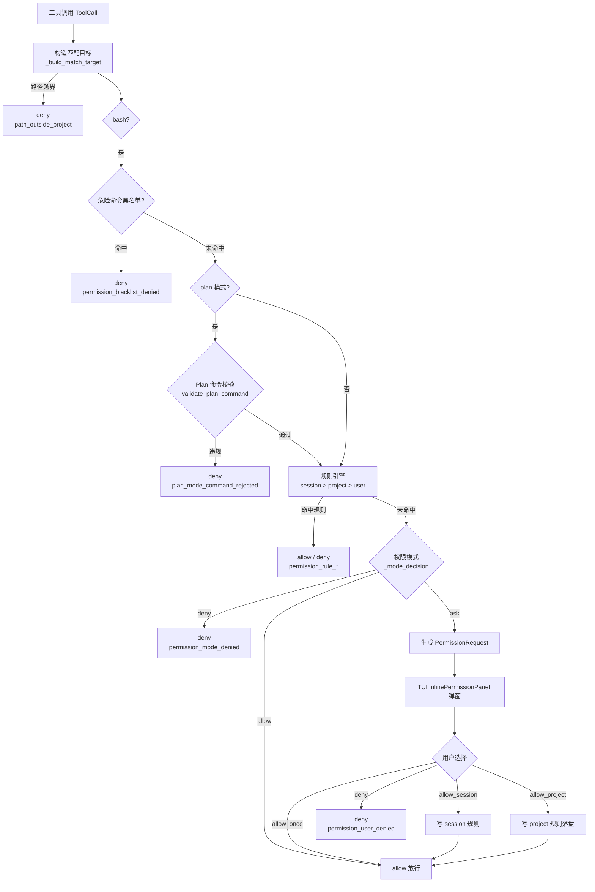

# 流程：权限判定与人在回路

本文描述一个工具调用从发起申请到获得决议的完整链路。

## 判定链



## 各阶段说明

### ① 匹配目标构造（`_build_match_target`）

| 工具 | 匹配值 |
|---|---|
| `bash` | 命令文本规范化（小写、空白折叠为单空格） |
| `read_file` / `write_file` / `edit_file` | 解析符号链接后的项目相对路径（正斜杠、小写） |
| `write_plan_file` | 计划文件相对路径 |
| `glob` | 模式本身（小写） |
| `grep` | 搜索范围路径 |
| MCP 外部工具 | 空值，规则按工具名精确匹配 |

### ② 黑名单与 Plan 校验

- 黑名单（`COMMAND_BLACKLIST_PATTERNS`）命中即拒绝，**任何模式（含 bypass）都不可绕过**
- Plan 模式只允许白名单前缀（查看、搜索、git 只读、版本查询），禁止重定向/管道/包管理命令

### ③ 规则引擎（`_match_rules`）

- 作用域顺序：session → project → user，**第一个有命中规则的作用域生效**；同一作用域内取最后一条
- 规则格式 `ToolLabel(value)`，支持 glob 通配符；MCP 工具用可见名 `mcp__<server>__<tool>`

### ④ 模式默认行为（`_mode_decision`）

| 模式 | read 工具 | write 工具（非 bash） | bash | MCP 外部工具 |
|---|---|---|---|---|
| default | allow | ask | ask | ask |
| plan | allow | ask | ask（Plan 校验约束） | 非只读 deny |
| acceptEdits | allow | allow | ask | ask |
| bypass | allow | allow | allow | allow |

（黑名单、显式 deny 规则、Plan 命令校验始终优先于表格结果。）

> 注：`write_file` / `edit_file` 的 `allowed_modes` 不含 `plan`，Plan 模式下它们在工具列表中被过滤；模型若仍调用会先在 `ToolExecutor` 被 `mode_disallowed` 拦截，不会走到权限引擎。`write_plan_file` 则只允许 plan 模式。

## 人在回路（⑤）

触发条件：规则与模式均未放行 → `PermissionEngine._build_permission_request()` 生成请求：

```text
PermissionRequest
 ├─ request_id（perm-xxxx）
 ├─ kind: command | file_edit | external_tool
 ├─ title / prompt / details（含命令、文件路径、diff 预览）
 ├─ session_rule / project_rule（建议规则，如 Bash(git *)）
 └─ metadata（mode、tool 信息）
```

传递路径：

```text
ToolExecutor._execute_one → PermissionEngine.evaluate → ask
→ ToolExecutor._handle_permission_check → permission_resolver(request)
   = TurnRunner._request_permission
       → 创建 Future，发 permission_request_created 事件
       → TUI _request_inline_permission：隐藏输入框，挂载 InlinePermissionPanel
       → 用户选择 → InlinePermissionPanel.Resolved(PermissionResolution)
       → TurnRunner.resolve_permission_request(resolution) 唤醒 Future
       → ToolExecutor.apply_resolution：allow_session/allow_project 写规则
```

## 决议后果

| 决议 | 本次调用 | 后续影响 |
|---|---|---|
| `allow_once` | 放行 | 无 |
| `allow_session` | 放行 | 会话规则 +1（内存，随会话保存/恢复） |
| `allow_project` | 放行 | 写入 `./.lancher/permissions.yaml` |
| `deny` | 拒绝 | 模型收到 `permission_user_denied`，可调整策略继续 |

## 异常路径

- 活动回合不存在或 Future 已 done → `resolve_permission_request` 返回 False，决议不生效
- 回合被取消 → 挂起的权限 Future 被取消，面板消失
- 无权限处理器（非 TUI 环境）→ `permission_confirmation_unavailable` 错误
