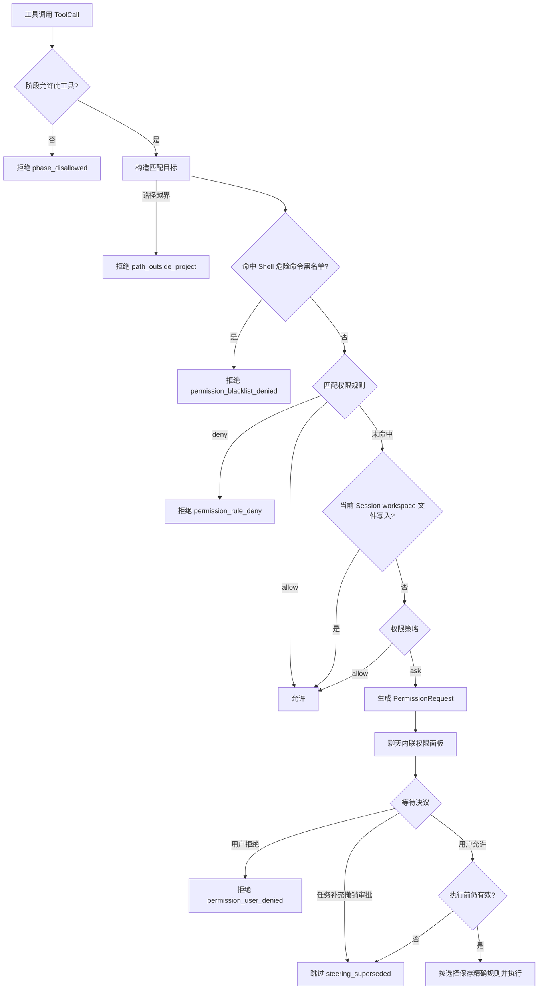

# 流程：工作阶段、权限判定与确认

每次工具调用先受工作阶段限制，再使用权限策略和规则判断是否需要确认。切换阶段不会改变权限策略；`bypass` 和任何已保存的允许规则都不能突破阶段限制。

## 两个独立维度

| 工作阶段 `work_phase` | 可用能力 |
|---|---|
| `discuss`（讨论） | 原生只读调查工具、当前 Session workspace 文件读写，以及明确声明 `readOnlyHint=true` 的 MCP 工具 |
| `plan`（计划） | 讨论阶段的能力，加 `write_plan_file` 写入专用计划文件 |
| `execute`（执行） | 已注册且在执行阶段可用的工具；实际调用仍受权限判定约束 |

讨论和计划阶段都禁止通用 Shell，包括看似只读的 `git status`、`git diff` 等命令。MCP 的只读边界依赖服务端声明；未声明或声明为 `false` 的工具在这两个阶段不可用。`write_plan_file` 只在计划阶段可用，正文必须非空。

| 权限策略 `permission_policy` | 原生读工具 / 只读 MCP | 原生写工具 | Shell / 其他 MCP |
|---|---|---|---|
| `default` | allow | ask | ask |
| `acceptEdits` | allow | allow | ask |
| `bypass` | allow | allow | allow |

此表只作用于已经通过阶段、路径、危险命令黑名单和规则判定的调用。当前 Session 的 `workspace/` 已批准内置文件工具读写，讨论和计划阶段也可写入此目录；普通源码和 Shell 仍按阶段与策略判断。显式规则按 session → project → user 的作用域优先级匹配，同一作用域取最后一条命中规则。

## 判定链



工具发现、执行器和权限引擎共享阶段边界。模型即使直接猜中隐藏工具名，也不能绕过阶段过滤。执行器在每组工具开始前及审批返回后检查取消或补充消息；已经启动的并行组收齐结果，尚未启动的后续组返回 `steering_superseded`。

## 匹配目标与授权范围

| 工具 | 新确认产生的精确规则 |
|---|---|
| `run_command` | 完整命令，例如 `RunCommand(git status --short)`；保留大小写及命令内部空白 |
| `read_file` / `write_file` / `edit_file` | 解析符号链接后的项目相对路径，按现有路径规范化规则比较 |
| `write_plan_file` | 专用计划文件的项目相对路径 |
| `glob` / `grep` | 分别为搜索模式、搜索范围 |
| MCP 工具 | 完整可见名，例如 `mcp__github__get_issue`；授权该工具，不绑定某组参数 |

新确认保存 `match_kind: exact`，字符 `*`、`?`、`[` 不会被当作授权通配符。不会把 `git status` 自动扩成 `RunCommand(git *)`。人工维护的 `match_kind: glob` 支持通配符；未带 `match_kind` 的旧规则作为 `legacy` 保留原匹配行为。

## 确认与关闭

`PermissionRequest` 包含 `request_id`、工具调用、`work_phase`、`permission_policy`、命令或文件差异预览、`session_rule` / `project_rule` 以及 `match_kind`。

```text
ToolExecutor → PermissionEngine.evaluate → ask
→ TurnRunner._request_permission 创建 Future
→ permission_request_created → 聊天内联权限面板
→ 用户选择 → resolve_permission_request 唤醒 Future
→ 执行器重新检查取消与补充 → apply_resolution → 执行工具
```

| 决议 | 本次调用 | 后续影响 |
|---|---|---|
| `allow_once` | 放行 | 不保存规则 |
| `allow_session` | 放行 | 保存会话精确规则，随 UUID Session 自动持久化 |
| `allow_project` | 放行 | 精确规则写入 `./.lancher/permissions.yaml` |
| `deny` | 拒绝 | 返回 `permission_user_denied`，模型可调整策略 |
| `superseded`（内部状态） | 跳过 | 不保存规则，返回 `steering_superseded` |

提交“补充当前任务”立即撤销仍在等待的审批。`superseded` 不是用户可选按钮，也不表示用户拒绝；即使随后删除该补充，已撤销的审批仍不会执行或保存允许规则。旧面板的迟到决议返回 `False`。

进程输入和转后台请求仅提供允许本次与拒绝，不生成 Session 或项目永久输入授权。任务窗口中用户实际点击和发送的控制操作则直接交给有归属检查的 Runtime；模型请求仍经过这条权限判定链。管理进程的停止、查询和等待不因切到讨论或计划阶段失去入口。

每个审批退出时发 `permission_request_closed`，用于移除内联面板；撤销的审批不发 `permission_request_resolved`。正常等待审批时输入区仍可用于补充或排队。

## 中断与恢复

- 取消任务会取消挂起的审批并暂停待处理队列；没有权限处理器时返回 `permission_confirmation_unavailable`。
- 尚未启动的取消明确记录未执行；已开始的本地操作说明可能部分执行；已开始的远端写操作记录结果未知，先检查实际状态，不自动重试。
- 新 Session 事件格式 v1 恢复时，所有待处理输入均为 `paused`。尚在生成的消息收拢为已取消；缺少结果的工具调用按批次补齐未知错误结果，不自动重放工具。
- 恢复会话不会读取项目旧 `plan.md` 并把它当成已确认计划。执行计划使用当前会话的快照正文与摘要，阶段切换不附带权限升级。
