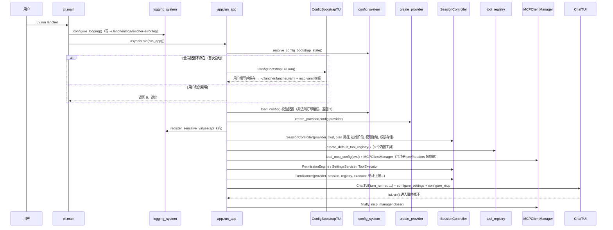

# 流程：程序启动

启动入口链：`main.py` / `__main__.py` / console script → `lancher_code/cli.py:main` → `lancher_code/app.py:run_app`。

## 时序图



（`REG` 表示工具注册表；`PermissionEngine / SettingsService / ToolExecutor / TurnRunner` 的创建统一归到装配步骤，详见 [../modules](../modules/) 各模块文档。）

## 启动步骤详解

| 步骤 | 代码位置 | 说明 |
|---|---|---|
| 1. 参数解析 | `cli.py build_arg_parser()` | 当前无任何参数 |
| 2. 日志初始化 | `cli.py configure_logging()` | ERROR 级、滚动文件（5MB × 5）、敏感值脱敏；目录不可写回退 stderr |
| 3. 引导判定 | `config_system/bootstrap.py` | `needs_setup = ~/.lancher/lancher.yaml 不存在` |
| 4. 首次引导 | `tui_views/bootstrap.py` | 填写协议/模型/Base URL/API Key/超时/thinking；保存并创建 MCP 模板 |
| 5. 加载配置 | `config_system/loader.py load_config()` | YAML 解析 + 完整校验；失败打印 `[错误]` 并退出码 1 |
| 6. 创建 Provider | `providers/factory.py` | 按 `protocol` 返回 OpenAI/Claude 实现 |
| 7. 敏感值注册 | `logging_system.register_sensitive_values()` | api_key 与 MCP env/headers 值，日志脱敏 |
| 8. 创建会话控制器 | `session.py SessionController` | 绑定 cwd、初始阶段与策略、权限存储；首条用户消息才创建 UUID Session 与独立 workspace |
| 9. 创建工具集 | `tools/__init__.py` | 注册 read_file / write_file / edit_file / bash / glob / grep / write_plan_file / tool_search |
| 10. 创建 MCP | `mcp/manager.py` | 加载全局+项目配置；TUI 挂载后异步初始化 |
| 11. 创建执行链 | `tools/core/executor.py` + `permission_engine.py` | ToolExecutor 持有注册表与权限引擎 |
| 12. 创建 TurnRunner | `turn_runner.py` | 注入全部依赖，配置循环上限与未知工具熔断 |
| 13. 启动 TUI | `tui_views/chat.py` | 进入 Textual 事件循环；MCP 初始化完成后启用输入 |
| 14. 退出清理 | `app.py finally` | `mcp_manager.close()` 关闭所有 MCP 连接 |

## 启动失败的常见退出

| 退出码 | 场景 | 表现 |
|---|---|---|
| `0` | 引导被取消 | 直接退出，不写配置 |
| `1` | 配置非法（YAML 错误 / 缺必填项 / protocol 不支持） | 终端打印 `[错误] <原因>`（红色），退出码 1 |
| `1` | 其他未捕获异常 | 写入日志（`event=application_uncaught_exception`），退出码 1 |
| `130` | 启动阶段 Ctrl+C | `KeyboardInterrupt`，退出码 130 |

## 首次启动的产物

```text
~/.lancher/lancher.yaml      ← 引导界面写入的主配置
~/.lancher/mcp.yaml          ← 自动生成的 MCP 模板（ensure_user_mcp_config）
~/.lancher/logs/lancher-error.log  ← 日志（启动时即创建）
```
