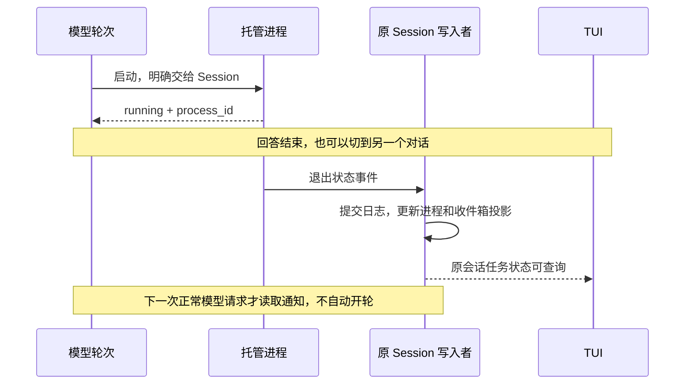

# 工具执行：一次调用结束以后，进程还能继续做事

假设你要修一个前端页面。开发服务器需要一直运行，测试只跑几十秒，模型还要读文件、改源码。旧的「启动命令 → 等它退出 → 返回全部输出」把这些事情绑在了一起：服务器不退出，模型就无法往下走；用户停止回答，又很难说清楚究竟该停哪些进程。

现在一段对话拥有自己的托管进程。启动、等待、读输出、输入和停止分别是操作；进程的寿命由所属范围决定。本文从这段使用场景出发，解释每一个容易被忽略的实现细节。接口速查见 [工具模块](../modules/tools.md)，用户操作见 [交互与命令](../cli-and-interaction.md)。

## 先分清三个「结束」

| 对象 | 举例 | 结束表示什么 |
|---|---|---|
| 模型轮次 | 「帮我启动服务器并查一下页面问题」 | 这轮回答和工具循环结束 |
| 工具调用 | `run_command` 启动服务器 | 这次启动请求已返回结果 |
| 真实进程 | 运行中的开发服务器 | 操作系统进程及其托管子进程退出，输出收尾完成 |

工具返回 `status=running` 时，只说明命令已经启动且仍在运行。它没有宣告构建、测试或服务最终成功。服务器以后退出，产生独立的 `process.exited` 事件，不会给原来的工具调用补第二个结果。这保证一个模型工具调用只有一个对应结果，也让界面可以同时展示「启动调用成功」「服务器后来异常退出」。

每次调用有应用生成的 `invocation_id`，另保留模型协议的 `provider_call_id`；每个进程有独立 `process_id`；二者都绑定 `session_id` 和来源 `turn_id`。它们使用 UUID hex，PID 只作为诊断信息。PID 会被系统复用，用保存下来的 PID 接管或停止旧进程，可能碰到完全不相关的程序。

调用状态依次经过 `queued`、`awaiting_permission`、`waiting_resources`、`running`，最后成为 `succeeded`、`failed`、`cancelled`、`superseded` 或 `interrupted`。`interrupted` 用于无法完整确认的执行，包括已开始但结果未知的远端写操作；界面另显示「结果未知」。没有询问或不必排队时会跳过中间状态。进程则经过 `starting`、`running`、`stopping` 到结束状态；应用重启后无法接管的记录成为 `lost`。`readiness` 是另一条独立信息：进程在运行不等于服务已经就绪。

数据契约在 [`execution/contracts.py`](../../lancher_code/execution/contracts.py)。系统句柄、管道和锁留在运行时，不序列化进 Session。

### 为什么轮次要先绑定，再启动

`create_task()` 不保证新任务一定等到下一次事件循环才执行。真实 TUI 启动时会启用立即执行任务的调度方式：新协程可以在 `create_task()` 返回之前就运行到第一个真正需要等待的位置。

因此不能先启动轮次，再把它写入「当前轮次」。任务若抢先读取当前轮次，便会得到空 ID；第一轮收尾封住这个空 ID 后，后续轮次可能一直收到「执行范围已停止，不能启动新进程」。这属于初始化顺序错误，与 Python 命令或用户审批无关。

轮次启动现在有一道明确的门闩：任务先等待，完整轮次对象（UUID、任务句柄、事件队列和取消信号）发布后才开放。执行体直接持有这个对象，开始、工具调用、进程归属和结束事件始终使用同一个 UUID。这里依靠明确的先后关系，不靠延时或猜测调度速度。

任务完成回调负责结束事件队列。即使用户在门闩开放后、执行体真正开始前立即停止，也能唤醒正在等待事件的界面，收拢任务。回归同时覆盖普通与立即执行调度，并用真实 TUI 启动路径验证审批和后台 HTTP 服务。

## 参数校验：先弄清要做什么，才讨论能不能做

模型传来的 JSON 还不是可以直接执行的请求。比如 `yield_ms` 写成负数、进程 ID 缺失，或 MCP 的条件参数不满足要求，都应在询问用户或占用资源之前明确拒绝。

执行器先复制并冻结参数，再按工具声明的 JSON Schema 校验。内置工具使用严格参数结构；外部工具的 `$defs`、局部 `$ref`、组合条件和 `if/then` 也由标准 Schema 实现解释。拿到资源以后再校验一次，避免排队期间绕过执行边界。参数不合法返回 `invalid_arguments`；Schema 本身错误、未知规范版本或无法解析的引用返回 `invalid_schema`，都不启动工具。

引用解析使用离线注册表，只接受当前 Schema 可解释的局部或内嵌引用；不会为一个工具声明偷偷访问网络或读取外部文件。这样「验证参数」本身不会成为额外副作用。实现见 [`tools/core/validation.py`](../../lancher_code/tools/core/validation.py)。

## 两个时钟：等待一秒，不是只能运行一秒

启动一个命令可以这样表达：

```json
{
  "command": "npm run dev",
  "description": "启动当前项目的开发服务器",
  "transport": "pipe",
  "lifetime": "session",
  "yield_ms": 1000,
  "max_runtime_ms": null
}
```

- `yield_ms` 决定这次启动调用愿意等多久。进程如果很快结束，就返回退出状态；否则返回运行状态和进程 ID。
- `max_runtime_ms` 决定进程最多能运行多久。它是另一个计时器，到期会执行真实停止流程；`null` 表示没有人为运行期限。
- `process_wait` 的等待上限同样只影响等待者。等待超时不会杀进程，可以稍后再查。

例如，测试运行上限设十分钟，启动时只等一秒。模型拿到句柄后可以先读取相关代码，再用 `process_wait` 等测试；十分钟到期才停止测试。开发服务器则明确交给 Session，允许跨轮次继续运行。

这也解释了为何通用工具调用超时不能直接包住整个后台进程：它只适用于一次短操作。命令启动的有限等待、后续查询和真实运行期限各自有边界。

## 本轮进程和会话后台，差别在「由谁负责」

`lifetime=turn` 表示进程归本轮管理，本轮完成、失败或取消时收尾。`lifetime=session` 表示明确交给 Session，停止当前回答不停止它。返回进程句柄本身不会偷偷改变归属。

运行中的本轮进程也可以通过 `process_background` 或任务窗口的「转后台」交给 Session。转交操作与停止操作受同一托管状态约束：正在停止的进程不能被救回后台；已经确认转交的进程不再被本轮收尾处理。日志记录其归属变化。

| 用户动作 | 结果 |
|---|---|
| 输入区 Esc，或工作中 Ctrl+C | 停止本轮；保留明确交给 Session 的后台进程 |
| `/tasks stop <进程UUID>` | 停止指定进程和它的托管子进程，保留日志 |
| `/session stop` | 停止当前轮次及当前 Session 的全部托管进程 |
| `/session new` / `resume` | 本轮结束后切换对话；原 Session 后台进程继续 |
| 退出应用 | 清理应用托管的全部进程，再关闭 Session 写入者 |

Esc 遵守焦点层：命令补全菜单中关闭菜单，审批面板中拒绝该次审批，任务弹窗中返回，主输入区中停止本轮。这样不会因为关闭一个详情页，意外停止用户的工作。

停止整个 Session 是完整的收尾范围：即使模型轮次已经结束，后台进程仍在排空输出或释放句柄，也暂不接受该 Session 的新轮次与文件执行。等全部收尾结束才重新开放，查询和停止入口保持可用，避免旧清理与新工作交叠。

这个入口门闩使用引用计数：如果两个停止请求同时等待收尾，第一个完成不能把第二个仍在处理的范围提前开放。新轮次、切换和手动压缩也检查同一边界，不能从另一条入口绕进来。

停止保护还必须包住整个批次。只保护每个进程内部的清理并不够：用户再次停止时，某个子任务可能还没获得第一次执行机会，外层批次取消就会直接跳过它。现在整组停止任务独立运行，调用者即使被取消也会等它们真正完成；本轮收尾才能继续保存终态日志并结束事件消费者。

任务界面每次打开都会捕获所属 Session；后续刷新、输入和停止都携带这个身份。不能在按钮点击时读取「当前对话」来决定归属。实现见 [`tui/tasks.py`](../../lancher_code/tui/tasks.py) 和 [`tui/app.py`](../../lancher_code/tui/app.py)。

模型向现存进程写输入或转后台仍要经过权限层。stdin 可能是交互 Shell，也可能触发下一项副作用，所以此类请求只允许本次授权，不保存会话或项目的永久输入放行规则；显式拒绝和危险命令检查仍生效。用户在任务窗口实际发送输入属于直接操作，输入保留前后空白并加一个换行。

输入还有一个容易卡住的场景：目标不读取 stdin，系统管道便可能一直阻塞。输入接收有固定十秒期限，到期停止目标并记为 `input_timeout`。模型工具在写入中被取消，也先停止目标、释放实际阻塞的管道，即便目标已经属于会话后台。用户在详情页点击发送之后，控制操作交给 Runtime 独立持有；关闭详情只结束观察，不取消已经提交的输入。这两条路径反映不同的授权来源。

输入回执事件记录累计 UTF-8 字节数和状态，不再复制原始输入。它不能保证输入不会出现在别处：程序可能把输入回显到输出日志，模型工具参数也可能进入调用记录。任务详情可以看到输入接收状态和日志保存错误。

系统调用一次也可能只接受部分字节。PTY 和 Windows 管道后端会推进字节偏移，循环写完剩余内容；如果一次写入没有进展，就明确报错。只有全部字节接收成功才更新成功回执，避免中文输入恰好在多字节字符中间被截断，却显示「已发送」。

## 并行为什么需要资源锁

「这个工具可以并行」太粗糙：两个 `edit_file` 修改不同文件可以并行，修改同一文件就必须排序。现在执行器根据工具参数产生 `ResourceClaim`，声明要访问的资源及共享或独占方式。

| 操作 | 声明 | 效果 |
|---|---|---|
| 读取 `a.py` | 文件共享 | 多个读取可以一起进行 |
| 修改 `a.py` | 文件独占 | 与该文件读取、写入互斥 |
| 搜索一个目录 | 目录递归共享 | 与覆盖该范围的写入互斥 |
| 未知 Shell / MCP | 本次调用期间项目独占 | 保守排序；命令返回后台句柄后释放，MCP 在本次调用结束释放 |
| 向某进程输入、转后台 | 进程控制独占 | 同一进程的控制操作保持顺序 |
| 查进程、读输出、停止 | 管理入口 | 不被进程自己持有的项目锁挡住 |

路径先解析链接、规范化分隔符与 Windows 大小写。目录递归锁与它的子路径发生冲突，所以搜索整个目录不会刚好撞上正在提交的文件更新。

调度器一次授予一个请求需要的全部资源。假如 A 要先拿文件甲再拿文件乙，B 反过来，分批拿锁很容易两边互等；原子授予消除了这种「各拿一半」的死锁。冲突请求保持 FIFO，无冲突的后续请求可以先前进，避免一个正在等服务器的请求拖住所有无关查询。

停止还需要一条管理通道。假设八个普通并发名额都被 `process_wait` 占用，用户要求停止其中一个任务，停止请求不能也排在这些等待者后面。已知内置的 `process_stop/read/list/background` 不占普通并发额度，资源冲突与 FIFO 仍照常检查；`process_wait/write` 继续受普通额度约束。调度器会继续扫描后面的管理请求，不因第一个普通请求暂时没名额就停止扫描。

同一批模型调用中，冲突操作还保留原请求顺序；无冲突操作实际完成顺序可以不同。TUI 按完成事件更新，返回给模型的结果保持调用关联和请求顺序。

同一应用事件循环内，同项目的多个 Session 共用调度器。**资源锁不是跨独立 LanCher Code 实例的文件锁，也不是操作系统沙箱。**另一个程序仍可能修改文件，因此文件工具的「先读、版本未变、再写」检查仍保留。

实现见 [`execution/scheduler.py`](../../lancher_code/execution/scheduler.py) 与 [`tools/core/executor.py`](../../lancher_code/tools/core/executor.py)。

## 为什么服务器不能一直锁住整个项目

想象先启动 `python server.py`，再用 `curl.exe` 请求它。如果把未知命令的项目独占锁一直交给服务器，第二条命令即使已经批准，也只能等服务器退出；关闭服务器以后，请求又失去了服务对象。这种安排让正常开发流程互相等待。

资源锁现在区分两个期限：`lifetime=invocation` 只保留到本次工具调用结束，`lifetime=process` 保留到真实进程退出。未知 Shell 使用调用期间的项目独占：启动和本次有限等待仍按顺序进行，`run_command` 返回后台 `process_id` 后释放该临时项目锁。下一条请求或文件工具能继续工作，不需要先配置 profile。MCP 未声明资源时仍在整个本次调用期间项目独占。

这不是在证明任意后台命令没有文件副作用。后台脚本仍能自己写文件；调用期间的锁只协调应用已知的操作，操作系统访问范围没有因此缩小。需要持续保护构建目录、端口或其他共享资源时，用 `execution.command_profiles` 声明真实约定。

配置文件中的 profile 按命令匹配，首次命中生效；资源声明来自应用配置或工具实现，模型不能临时说一句「我是安全的」就降低限制。每个 profile 必须明确填写 `resources`；`resources: []` 表示用户约定该命令不占用调度资源，省略或拼错字段会被拒绝。配置时应根据真实命令副作用判断，不能机械复制示例。

profile 中的每项资源默认 `lifetime=process`，也可显式指定 `invocation`。例如服务器持续独占专用输出目录，但只有启动时需要独占某个初始化文件，两项资源可以放在同一租约里：调用结束释放初始化文件，剩余目录资源由 `ProcessSupervisor` 保留到进程退出并完成清理。短工具无论声明哪个期限，都在本次调用结束释放；没有真实进程就不存在持续持有者。

后台进程保留持续资源时，不占普通工具的并发额度；它有单独的全局、Session 进程数量限制。这防止启动几个服务器后把所有查询名额永久占满。

资源约定的配置示例和默认额度见 [配置说明](../configuration.md)。

## 你已经批准了，为什么还在等待

批准解决的是「可不可以执行」，资源队列解决的是「现在能不能执行」。界面从真实调用状态更新：待批准时需要你决定；显示「等待资源」时，权限检查已通过，但工具尚未开始。取得租约后才进入「执行中」阶段。取消仍在排队的调用，结果会明确保留「没有执行」。

展开等待详情，可以看到资源冲突、普通并发名额用满或前方冲突请求这三类原因。冲突任务由调度器按实际持有的租约列出，包含进程完整 UUID、所属 Session 和持续占用的资源；不会把所有后台任务都当成阻塞者。比如你明确配置某服务器持续独占整个项目，后续文件修改就会等待它释放资源，这时仍能在所属会话用 `/tasks show <进程UUID>` 查看或停止它。不同 Session 共用项目调度器，阻塞者可能属于另一对话，需要切换到那个对话再操作。

同批冲突调用的前序等待仍属于「等待执行」，尚未进行该调用的审批，不能显示已经批准。状态快照先持久化，再经执行器回调送到 Runner 和时间线；开始执行或进入终态后清除旧等待说明，避免拿昨天的阻塞者解释已经完成的操作。

还有一个很短的窗口：界面刚收到「执行中」通知，工具的 `execute` 还没真正开始。状态通知会让出事件循环，停止恰好可以在这里发生，所以不能从运行标签推断远端请求已经发出。每条对话轨迹绑定稳定的 `invocation_id`，取消收尾查看这次调用的已提交终态：尚未派发的远端写操作是 `cancelled`，结果明确「未启动」；确实进入远端工具后才是 `interrupted` 与 `mcp_outcome_unknown`。这样用户既不会被一个并未发送的请求吓成「结果未知」，也不会把真正已发起的写操作当成可以直接重试。

## 停止时最难的是：你刚点停止，它才刚启动

执行入口有 Session 的 `generation`。停止会使旧代次失效；审批通过、资源锁取得以后，执行器再次检查代次、取消令牌、阶段和实际权限。用户早已停止的请求，即便批准按钮或网络回调迟到，也不能开始执行。

另外一个窗口在操作系统创建进程期间。取消 Python 等待，并不保证后台工作线程没有创建成功。托管层会等待创建任务拿到真实句柄，再终止并回收；重复取消也不能把这段收尾打断。宁愿停止稍晚完成，也不能产生无人管理的进程。

停止过程先封闭范围，撤回尚未执行的审批与排队调用，然后尝试中断，超过收尾期限再强制终止，最后排空输出、释放句柄与租约。重复停止复用同一个收尾任务，是幂等操作。

资源刚授予时还有一次交接：调度器要先结束监听取消和等待通知的辅助任务，才能把租约返回给调用者。这个清理会让出事件循环，停止也可能恰好在这里到达。因此成功路径把清理放在同一个异常回收范围内，等辅助任务全部退出后，再检查取消令牌并同步返回租约；如果此时取消，调度器负责释放尚未交出的锁。重复停止也必须等这些辅助任务结束，避免留下一把没有持有者、却一直阻塞后续调用的锁。

已经完成的文件修改不自动回滚。文件写工具使用同目录临时文件，刷新并同步内容，再于提交前检查取消、权限和读取版本，最后原子替换；提交成功后记录成功。远端 MCP 则不同：停止本地等待无法证明服务器撤销了操作。已开始的外部写操作在取消、超时或运输故障后，保留 `mcp_outcome_unknown`，界面显示「结果未知」，提醒先检查远端真实状态，不自动重试。尚未获准或仍在排队的请求明确显示「未执行」，不能把它说成可能已经修改过。

创建、控制和收尾在 [`execution/processes.py`](../../lancher_code/execution/processes.py)；轮次取消在 [`agent/runner.py`](../../lancher_code/agent/runner.py)。

## Windows：只杀 PowerShell 为什么不够

命令常有这样的树：PowerShell 启动 npm，npm 又启动 Node 和编译器。只停止外层 PowerShell，服务器和编译器可能仍运行，而且继承的输出管道仍被占用，读取者迟迟得不到 EOF。

Windows 后端采用 **Job Object** 管理常规子进程组，并设置 `KILL_ON_JOB_CLOSE`。启动过程是：

```text
创建 Job → 挂起创建进程 → 绑定 Job → 恢复执行
```

绑定完成之前不让命令正常执行，避免它抢先派生未托管的子进程。根进程正常退出后，也回收同组遗留子进程；清理条件是整组与输出都已收尾，不只是观察到根进程退出码。

普通无控制台 Pipe 进程不一定支持温和的 Ctrl+C，因此该后端可直接走 Job 级终止。PTY 进程可以先传递 Ctrl+C，再按期限升级强制停止。界面显示实际退出原因，不宣称所有命令都经历了优雅关闭。

Windows 的 `KILL_ON_JOB_CLOSE` 兜底回收甚至可能留下退出码 0。因此判定取消必须结合明确的 `status` 和 `exit_reason`，不能看到 0 就把用户停止的任务报告成成功。清理异常也有独立的 `cleanup_error` 原因，句柄关闭仍放在最终收尾中执行。

POSIX 后端使用独立进程组，同样针对组发送信号。平台差异封装在后端接口里，工具和 TUI 不需要拼平台专属杀进程命令。

PowerShell 后端采用普通文本命令输出并设置 UTF-8，外部程序的 `$LASTEXITCODE` 会保留为真实退出码。不能把所有非零退出都改写成 1，否则测试工具的不同退出原因会丢失。ConPTY 启动明确配置标准句柄，防止子程序意外继承 LanCher Code 自己被重定向的 stdout，绕过进程日志采集。

这些是本地托管机制，不能接管远程服务、系统服务或已经脱离托管组的外部工作。实现见 [`execution/windows.py`](../../lancher_code/execution/windows.py) 与 [`execution/backends.py`](../../lancher_code/execution/backends.py)。

## Pipe 和 ConPTY：日志模式与终端模式

普通测试、构建默认用 `pipe`：stdout 和 stderr 分别读取，记录来源，在总体输出游标里按采集顺序拼接。这里的顺序是应用实际读到的顺序，无法承诺两个系统管道之间的绝对写入时序。

交互程序使用 `pty`。Windows 对应 ConPTY，输出成为一个 `terminal` 流，可以写输入、传递终端控制并调整尺寸。ConPTY 是进程传输后端，任务窗口是有限日志视图，不是完整的终端模拟器；全屏终端程序的控制序列可能无法在日志页复现原界面。

ConPTY 关闭可能等待输出被读走，因此关闭伪终端句柄在工作线程执行，读取者持续排空；关闭等待有期限，必要时断开通道，并在最终收尾中关闭 Job、进程和标准句柄。原生后端使用独立的有限线程池，避免多个长期管道读取占满 asyncio 默认线程池，拖住其他短操作。后端提供 `read/write/wait/interrupt/terminate/resize/close`，以后接远程执行宿主时可以沿用这一层。

POSIX PTY 用 `posix_spawn` 建立新会话，再打开终端 slave 取得控制终端。只是把标准输入输出接到一个伪终端，未必能让 `/dev/tty` 可用；这一步区分「看起来像终端」和「真实可交互终端」。它也避免多线程 Python 进程在 fork 后使用 `preexec_fn` 的复杂风险。

## 中文输出不能按每一块单独解码

UTF-8 的一个汉字有多个字节，系统读取块可能正好切在汉字中间。每块单独 `decode()` 会产生乱码。OutputStore 为 stdout、stderr、terminal 分别保留增量解码器，把不完整字节留到下一块；流结束时再做最终解码。

输出读取使用**累计解码字符游标**。例如第一次读到第 100 个字符，下一次从 100 继续；单个大块超过 `max_chars` 时只返回预算允许的部分，下次续读剩余内容，不跳过整个块。模型与 TUI 都持有自己的游标，读取不会消费或删除别人要看的内容。

游标还有一个提交竞态：写线程可能已把新块追加到文件，事件循环还没发布新的字符计数。读取只看到已经提交的游标上界，不能先读到新块、下次却被判断为游标越界。取消发生在追加期间时，等这一块写完并提交计数后再传播取消，避免磁盘已有内容却丢掉对应位置。

三个数字分别管理不同成本：

| 数字 | 计量 | 用途 |
|---|---|---|
| `cursor` / `next_cursor` | 解码字符位置 | 精确续读，包括中文 |
| `max_chars` | 返回字符预算 | 防止单次工具结果撑爆上下文 |
| `output_limit_bytes` | JSONL 编码字节，含元数据 | 限制磁盘占用 |

完整分块日志持续追加到 `output.jsonl`；`output.index` 每隔一些块保存字符位置到磁盘字节位置的稀疏索引，恢复查看时不必每次从头扫。索引是加速缓存，不代替日志。

达到磁盘配额时停止进程，退出原因记为 `output_limit`，保留已保存内容；当前实现不轮转，也不会默默删除旧日志。任务窗口固定保留约 48,000 字符的最近显示内容，并说明更早内容仍在磁盘；后端每次读取 4096 字节，没有把完整输出放进无限内存缓冲。实现见 [`execution/output.py`](../../lancher_code/execution/output.py)。

## 事件收件箱：完成了，也不偷偷唤醒模型

后台任务每输出一行就请求一次模型，会非常吵，也很浪费。输出写独立日志，Session 的事件日志只保存关键状态变化。进程结束先提交 `process.exited`，再把通知投影进所属 Session 的收件箱。

下一条用户消息进入 Session 时，最多 20 条待处理完成通知作为结构化事实摘要附到协议消息中；先保存包含摘要的消息，再确认收件箱已送达。摘要只含进程身份、状态、退出码、原因与归属，输出仍通过进程工具读取。仅仅后台完成不会启动新回答；用户停止后也不会因此自动继续队列。TUI 每秒从内存投影刷新后台和未读通知数量，提示用 `/tasks` 查看；没有后台或通知时省略徽标。用户需要时再发送下一条消息。

事件必须写到原 Session。切换对话后，`SessionRuntimeRegistry` 保留原服务、状态和写入者，后台回调使用保存的绑定，而不是查当前界面。多个来源仍通过同一写入者提交，继承 Session 的单写入者锁。应用退出先收尾进程，最后关闭这些写入者。

原 Session 最后一个后台进程完成后，Runtime 在下一次事件循环检查点保存快照并释放非当前 Session 的写入者；已提交的输入控制尚未结束时，等它收尾再释放。当前界面对应的 Session 保留写入者。这样离开一个对话不会误丢事件，也不会让已经空闲的旧对话长期占着写锁；以后恢复空闲对话时重新从磁盘加载。



实现见 [`execution/runtime.py`](../../lancher_code/execution/runtime.py)、[`sessions/codec.py`](../../lancher_code/sessions/codec.py) 与 [`agent/runner.py`](../../lancher_code/agent/runner.py)。

## 存储失败时，哪些事必须坚持，哪些事必须停止

启动记录必须可靠提交后，才允许创建真实进程。否则应用已经做了事情却没有记录，恢复时无法解释。

进程已运行以后，如果写输出失败或运行状态事件无法保存，托管层按失败处理并收尾，避免继续执行无法记录的工作。**停止不依赖保存成功**：即使磁盘已满，也必须杀进程、关闭句柄和释放资源，再通过 `storage_error` 报告记录没有完整保存。保存「正在停止」或最终退出事件失败，也不能递归触发另一轮停止，让清理永远结束不了。

事件日志是状态事实，进程元数据文件则是派生缓存。启动时两者必须成功，后续缓存更新失败会报告错误；如果后台转交的事实已经提交，不会因为缓存失败又把它偷偷改回本轮归属。提交边界之后不能假装撤销已经发生的变化。

查询也遵守这条事实优先级：当前应用仍持有真实进程句柄时使用实时状态；重启后的历史查询优先使用已恢复的 Session 投影。元数据缓存缺失、损坏或陈旧，都不能把日志中的真实终态遮住或改回运行中。恢复投影仍未结束的记录标为 `lost`，不会依据缓存里的 PID 接管外部程序。

模型调用结果同样先持久化再继续下一步。并行操作里若出现这类基础设施失败，收束整批；已经完成的副作用不会伪装成回滚成功。

## 重新打开对话不等于重新运行命令

应用仍在运行时返回原 Session，可以重新绑定现存进程和服务，继续读日志、输入、停止。

应用重启后，活动记录只能说明「上次看到它还在运行」。恢复会把它标记为 `lost`，未完成的调用标记为 `interrupted`，保留日志，不认领旧 PID、不自动运行旧命令。这避免一次原本已经成功的安装、提交或外部操作被再次执行。

当前后台能力持续到 LanCher Code 应用退出。关闭应用后仍要继续的任务，需要独立执行宿主、IPC 身份和重连协议；这次没有用 PID 文件假装实现该能力。归档和删除仍需先完成所属活动资源收尾，防止日志目录被正在运行的进程继续使用。

## 验证什么，才算这套机制真的工作

测试不只验证命令返回一个字符串。对应的关键场景是：

- 不同文件操作确实并行，同文件和父目录冲突按顺序执行；资源一次性取得，取消排队后不启动。
- 默认配置下，真实后台 HTTP 服务与后续请求可以共存；显式持续项目锁会显示已批准的资源等待、实际阻塞进程，停止该任务后排队命令才启动。
- 启动期间取消也回收句柄；重复停止不会打断清理；进程树没有遗留子进程。
- 停止本轮保留 Session 后台，停止 Session 与退出应用回收全部所属资源。
- 中文跨块解码、双流输出、严格分页预算与独立游标没有遗漏；输出配额失败有明确原因。
- 磁盘或事件写入失败阻止新副作用，现存进程仍能完成停止。
- 后台事件留在原会话，不自动请求模型；切换后继续管理，重启不重跑命令。
- TUI 的宽窄窗口、操作按钮、命令补全、草稿保留和停止范围符合实际行为。

测试分布在 `tests/execution/`、`tests/tools/`、`tests/agent/test_task_interaction.py`、`tests/agent/test_task_safety_regressions.py` 和 `tests/tui/test_tui_tasks.py`。`tests/tui/test_tui_execution.py` 直接使用真实 `run_async`、默认审批与原生命令，覆盖后台服务和资源阻塞的完整路径；时间线文案覆盖 100、60、32 列。运行方法见 [开发指南](../development.md)。未来增加新工具或后端时，优先复用这些契约与边界，而不是为某个命令再写一套临时后台逻辑。
