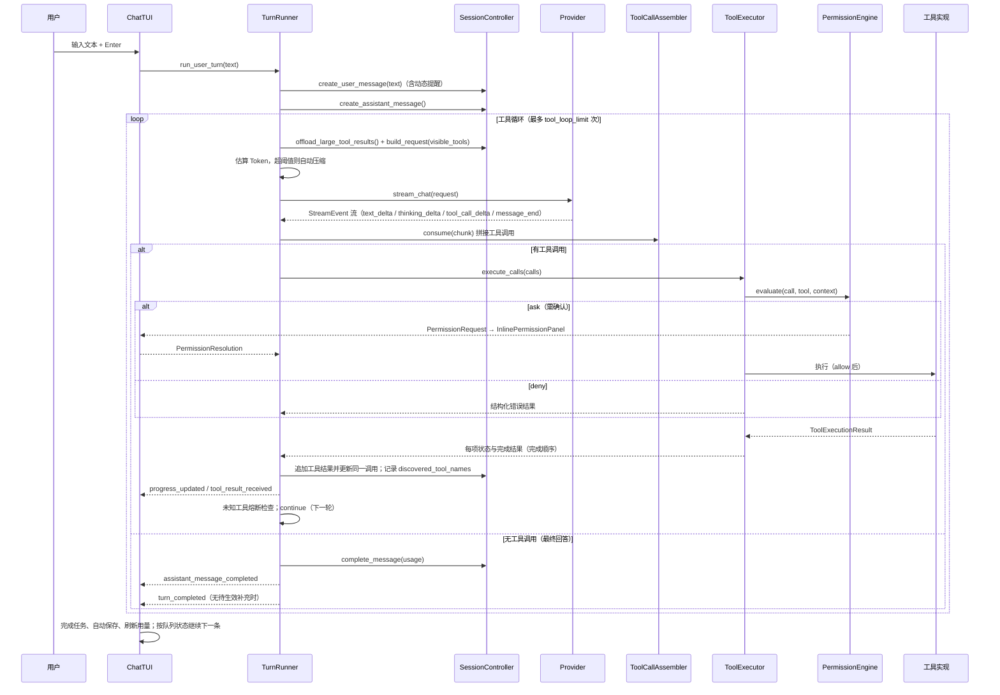

# 流程：一轮对话（用户输入 → 最终回答）

本文描述一次普通用户输入（非斜杠命令）的完整处理链路。

## 时序图



## 关键环节说明

### 1. 提交与事件流

- 输入经 `ComposerSubmitted` 进入 `LanCherTextualApp.handle_input_submitted`；先解析斜杠命令，非命令才走 `process_prompt(text)`。
- `TurnRunner.run_user_turn()` 是异步生成器；TUI 用 `@work` 后台任务逐个 `await` 事件，事件驱动界面刷新。

### 2. 请求组装（`SessionController.build_request`）

- 可见工具 = 注册表中按工作阶段过滤后的定义（含上一轮 `tool_search` 发现且阶段允许的 MCP 工具）；审批策略独立传入
- system = 系统提示 + 环境提示 + 动态提醒 + 延迟工具索引
- messages = 协议无关 transcript（剥离旧 reminder、注入新 reminder）

### 3. 流式消费（`agent.streaming.collect_response`）

- `text_delta` → 追加消息内容与有序正文段，TUI 在当前位置逐步显示正文
- `thinking_delta` → 追加有序思考段，TUI 以灰色展开内容，不增加“思考”标题
- `tool_call_delta` → `ToolCallAssembler` 按 `call_index` 拼接名称与参数 JSON
- 段类型变化或响应结束 → 封口当前段，不能跨中间正文或下一次响应合并思考
- `message_end` → 取出 usage，表示当前模型响应结束，不代表整个任务结束
- 模型报"上下文超长"（`ProviderPromptTooLongError`）→ 紧急压缩后重试一次

### 4. 工具执行（`ToolExecutor.execute_calls`）

- 先做集合级检查：未加载工具（`tool_not_found`，提示 tool_search）、阶段不可用（`phase_disallowed`）。讨论／计划禁止源码写入与通用 Shell，但当前 Session workspace 的文件读写已批准
- 参数复制冻结，按标准 JSON Schema 校验；离线解析局部与内嵌引用，无效参数或 Schema 在审批与资源申请前失败
- 按资源声明判断冲突，无冲突工具并行，同资源操作按请求顺序执行
- 每个调用：`PermissionEngine.evaluate()` → deny 直接返回错误；ask 通过非阻塞内联审批面板等待结果
- 每项启动、等待批准和完成时立即通知界面；独立工具可以同时显示执行中，先完成的调用立即显示结果，不等待整组最慢的工具
- 普通工具有限时执行；命令的 `yield_ms`、`process_wait.timeout_ms` 只限制本次等待，`max_runtime_ms` 才限制真实进程运行期限
- 管理入口 stop/read/list/background 不占普通并发额度；资源锁与 FIFO 仍有效，wait/write 继续计入额度

### 有序记录与折叠

消息的 `trace.entries` 按实际输出顺序保存思考段、正文段与工具调用。每次调用保存 `call_id` 与 `group_id`，结果按 `call_id` 回到原调用位置显示，即使并发完成顺序不同，也不打乱工具列表。正文段与思考段保存输出状态；工具保存排队、执行、等待批准及终止状态，结果保留完整内容及错误码供详情查看。

执行时展开工具组及所有调用行，每条调用的参数和结果可独立展开；正常完成的多工具组默认收成一行数量摘要，单工具直接保留调用行，不嵌套两层折叠。思考在输出期间展开，结束后默认显示灰色首行摘要。手动展开／收起状态优先于后续流式刷新；失败和待批准操作直接可见。

当前会话只使用完整轨迹顺序，不再保留旧 timeline 标志或缺失轨迹时的正文拼接分支；旧事件格式在读取边界拒绝。

### 5. 循环终止条件

| 条件 | 结果 |
|---|---|
| 模型不再调用工具且没有待生效补充 | 正常完成（`turn_completed`）；消息段另发 `assistant_message_completed` |
| 循环次数 > `tool_loop_limit`（默认 50） | 失败，提示达到上限 |
| 连续 `unknown_tool_streak_limit`（默认 3）次未知工具 | 失败，停止无效循环 |
| 用户按 Ctrl+C | `turn_cancelled`，消息标记 CANCELLED |
| 模型请求被拒绝/异常 | `turn_failed`，消息标记 ERROR |

## 事件流速查（TUI 消费顺序）

```text
user_message_created
assistant_message_started
（循环内）progress_updated / assistant_text_delta* / usage_updated
（每组）tool_call_started / progress_updated* / tool_result_received*
（可能）permission_request_created → permission_request_closed
assistant_message_completed（消息段结束）
turn_completed | turn_cancelled | turn_failed（任务结束）
```

## 失败与取消后的状态

- **拒绝**：工具循环不中断，模型收到 `permission_user_denied` / `permission_blacklist_denied` 等结构化错误，可自行调整策略。
- **取消**：先封闭旧执行代次、撤回排队与审批，再收尾本轮所属进程；Session 后台保留。消息内容为空时填充"本轮已取消。"
- **失败**：消息标记 `error`，内容为错误文本；错误详情记入日志（`event=turn_failed_unexpected` 等）。
