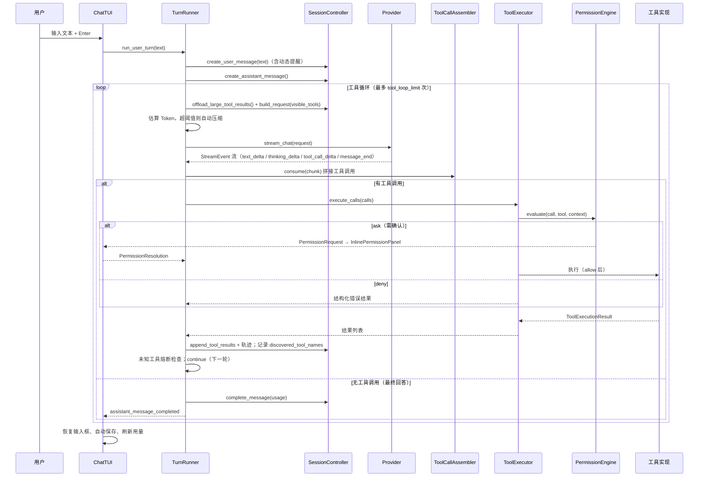

# 流程：一轮对话（用户输入 → 最终回答）

本文描述一次普通用户输入（非斜杠命令）的完整处理链路。

## 时序图



## 关键环节说明

### 1. 提交与事件流

- 输入经 `ComposerSubmitted` 进入 `ChatTUI.handle_input_submitted`；先解析斜杠命令，非命令才走 `process_prompt(text)`。
- `TurnRunner.run_user_turn()` 是异步生成器；TUI 用 `@work` 后台任务逐个 `await` 事件，事件驱动界面刷新。

### 2. 请求组装（`SessionController.build_request`）

- 可见工具 = 注册表中按当前模式过滤后的定义（含上一轮 `tool_search` 发现的 MCP 工具）
- system = 系统提示 + 环境提示 + 动态提醒 + 延迟工具索引
- messages = 协议无关 transcript（剥离旧 reminder、注入新 reminder）

### 3. 流式消费（`TurnRunner._stream_request`）

- `text_delta` → 追加消息内容，TUI 显示打字机效果
- `thinking_delta` → 写入思考轨迹，TUI 显示"模型正在思考"
- `tool_call_delta` → `ToolCallAssembler` 按 `call_index` 拼接名称与参数 JSON
- `message_end` → 取出 usage
- 模型报"上下文超长"（`ProviderPromptTooLongError`）→ 紧急压缩后重试一次

### 4. 工具执行（`ToolExecutor.execute_calls`）

- 先做集合级检查：未加载工具（`tool_not_found`，提示 tool_search）、模式不可用（`mode_disallowed`）
- 并发安全工具批量并行，非安全工具串行
- 每个调用：`PermissionEngine.evaluate()` → deny 直接返回错误；ask 走弹窗
- 统一 `asyncio.wait_for` 超时（默认 10 秒），异常归一化为 `ToolExecutionResult(is_error=True)`

### 5. 循环终止条件

| 条件 | 结果 |
|---|---|
| 模型不再调用工具 | 正常完成（`assistant_message_completed`） |
| 循环次数 > `tool_loop_limit`（默认 50） | 失败，提示达到上限 |
| 连续 `unknown_tool_streak_limit`（默认 3）次未知工具 | 失败，停止无效循环 |
| 用户按 Ctrl+C | `turn_cancelled`，消息标记 CANCELLED |
| 模型请求被拒绝/异常 | `turn_failed`，消息标记 ERROR |

## 事件流速查（TUI 消费顺序）

```text
user_message_created
assistant_message_started
（循环内）progress_updated / assistant_text_delta* / usage_updated / tool_call_started / tool_result_received*
（可能）permission_request_created → permission_request_resolved
assistant_message_completed | turn_cancelled | turn_failed
```

## 失败与取消后的状态

- **拒绝**：工具循环不中断，模型收到 `permission_user_denied` / `permission_blacklist_denied` 等结构化错误，可自行调整策略。
- **取消**：取消令牌贯穿请求与 bash 子进程；消息内容为空时填充"本轮已取消。"
- **失败**：消息标记 `error`，内容为错误文本；错误详情记入日志（`event=turn_failed_unexpected` 等）。
